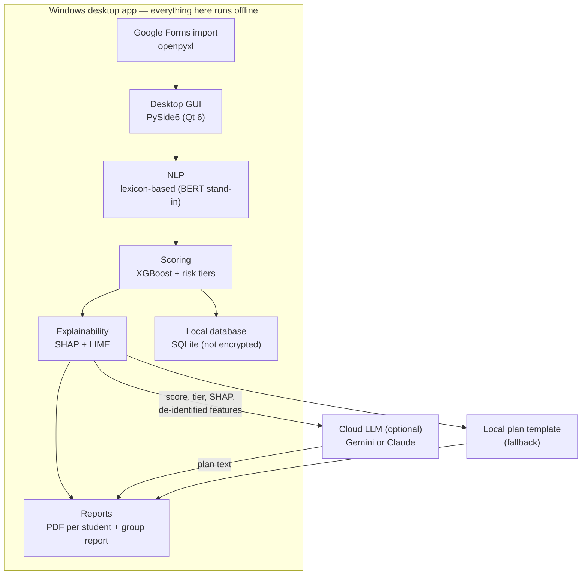

# Student Risk Assessment & Intervention Planner

A Windows desktop application (proof of concept) that helps teachers identify students at risk of school dropout and drafts explainable intervention plans. Scoring and explanation run entirely on the machine; the only network call is an optional request to an LLM (Gemini or Claude) that turns the already-computed result into a written plan.

> **Research prototype.** The classifier is trained on **synthetic data**, not on real student records (see [Training data](#training-data-synthetic)). Its scores and explanations demonstrate that the pipeline works; they are not evidence about the real causes of dropout and must not be used on their own to make decisions about students.

## Overview

A teacher fills in a 17-question questionnaire for a student, or imports a batch of Google Forms responses (`.xlsx`). The app then:

1. derives the model features from the answers, including a **Studentship** score and an **emotional-stress** score from the free-text answers;
2. scores the student with an **XGBoost** classifier, giving `P(dropout)` and one of four **risk tiers**;
3. explains the score with **SHAP** (additive decomposition) and **LIME** (local rule list, with its fit quality);
4. drafts a **"Proiectul Podul" intervention plan**, through the cloud LLM if a key is configured, otherwise from a local template;
5. exports a 4-page **PDF report** per student, plus a **group report** that ranks a batch of students by urgency.

Every result is decision support for a teacher to review, not an automated decision.

## Architecture



### Components

| Component | Code | What it does |
|---|---|---|
| **Desktop GUI** | [app/ui/](app/ui/) | PySide6 window: questionnaire, result panel, plan pane, menus (questionnaire import, settings, model, performance, appearance, help) |
| **Questionnaire import** | [app/excel_import.py](app/excel_import.py) | Reads the Google Forms `.xlsx` export and maps each answer to the questionnaire keys |
| **NLP** | [app/nlp_engine.py](app/nlp_engine.py) | Romanian **lexicon** valence analyzer (47 negative / 24 positive weighted terms, 3-token negation window) producing `Stres_Emotional_NLP` in `[0, 2]`. A stand-in with the same contract as the BERT/ONNX model of the original design |
| **Scoring** | [app/scoring_engine.py](app/scoring_engine.py) | Derives the model features, trains or loads the XGBoost classifier (SMOTE-NC on the training split), returns `P(dropout)` |
| **Risk tiers** | [app/explainability.py](app/explainability.py), [app/config.py](app/config.py) | Maps the probability to *Scăzut / Mediu / Ridicat / Critic* (Low / Medium / High / Critical) plus one escalation rule; see [Risk tiers](#risk-tiers) |
| **Explainability** | [app/explainability.py](app/explainability.py), [app/lime_explainer.py](app/lime_explainer.py) | SHAP (permutation explainer, probability space) and LIME, both run on the real model |
| **Plan generation** | [app/llm_client.py](app/llm_client.py) | Cloud plan via Gemini or Claude, optionally grounded in a knowledge-base `.docx`; local template when there is no key or no network |
| **Reports** | [app/ui/report.py](app/ui/report.py) | Per-student PDF (input data; risk profile with SHAP, LIME and NLP; plan; success indicators) and the group prioritization report |
| **Local database** | [app/database.py](app/database.py) | SQLite store of cases and evaluations, **unencrypted** in this prototype |
| **Metrics** | [app/metrics.py](app/metrics.py), [app/model_report.py](app/model_report.py) | Model-evaluation figures and per-call LLM latency and cost tracking |

## Training data (synthetic)

No Romanian dataset currently links early indicators to later dropout, so the classifier is trained on **2,800 synthetic profiles** generated by `generate_synthetic_dataset()` ([app/scoring_engine.py](app/scoring_engine.py)) with NumPy's `default_rng(seed=42)`:

1. **Features** are drawn independently from plausible distributions (absences from a right-skewed gamma, module average from `N(7.1, 1.4)`, categorical answers from fixed proportions). `Studentship_Score` and `Stres_Emotional_NLP` are then *computed* from the other answers, the same way the app computes them for a real student.
2. **Labels** come from a **hand-specified logistic model**: `P(dropout) = σ(z)`, where `z` is a weighted sum of the features with author-set coefficients (`_RISK_LOGIT`): a saturating term for unexcused absences, the deviation of the average from 6.5, Studentship, attitude, participation, sanctions, perceived support, NLP stress, family situation, parental education and age above 16. Each label is then sampled as `Bernoulli(P)`. Prevalence is about 22.6%.

What this means:

- **The model learns the generator, not reality.** SHAP and LIME explain how the classifier approximates `_RISK_LOGIT`. They are not empirically estimated risk factors.
- **The ceiling is known.** Because labels are sampled, even a perfect model reaches only ROC-AUC ≈ 0.87 on the hold-out set; XGBoost reaches ≈ 0.83 (5-fold CV 0.82 ± 0.02).
- **Training is deterministic** for a given `--samples` and `--seed`: the same seed always gives the same model, whatever date appears in its version string.

To use real data, replace `generate_synthetic_dataset()` with a loader that returns the same columns and a real `Abandon` label, then retrain.

## Risk tiers

The tier comes from the **XGBoost probability**, plus one escalation rule. No other rule assigns tiers.

| Tier (RO / EN) | Colour | Urgency | Rule |
|---|---|---|---|
| Scăzut / Low | Green | Monitorizare / Monitoring | `P < 0.20` |
| Mediu / Medium | Yellow | Medie / Medium | `0.20 ≤ P < 0.42` |
| Ridicat / High | Orange | Ridicată / High | `0.42 ≤ P < 0.65` |
| Critic / Critical | Red | Maximă / Maximum | `P ≥ 0.65`, **or** a High case with ≥ 3 severe factors |

The severe factors are: ≥ 20 unexcused absences (3 months), an average below 5, Studentship ≤ 2, disciplinary *sanctions*, and reported stress or isolation (or NLP stress ≥ 1.3). Escalation applies only to High cases. The thresholds sit at break-points of the synthetic model's score distribution; they are not validated cut-offs. SMOTE-NC balances the training set to 50/50, so probabilities run higher than the 22.6% base rate.

Until October 2026 the lowest tier was called *Moderat*; evaluations saved under that name are displayed as *Scăzut / Low*.

## Questionnaire and model features

The model uses 17 features, derived from the questionnaire by `compose_model_features()`:

| Model feature | Source |
|---|---|
| `Age_Years` | Computed from the date of birth |
| `Sex`, `Mediu_Rezidential`, `Situatie_Familiala`, `Educatie_Mama`, `Educatie_Tata` | Questions 5–8 |
| `Absente_Nemotivate_Zilele_1_13` | Question 9: unexcused absences **in the last 3 months**. Despite its name, this column does **not** hold Day 1–13 absences; the name is kept so saved models stay compatible |
| `Absente_Motivate_3_Luni` | Question 10: excused absences in the last 3 months |
| `Participare_Extrascolara`, `Medie_Modul_Anterior` | Questions 11–12 |
| `Note_Sub_5` | Question 13, parsed: distinct numeric grades below 5, or the number of *Insuficient* marks (primary school). *Suficient* counts as passing |
| `Atitudine_Scoala`, `Sanctiuni_Avertismente`, `Cum_te_Simti_La_Scoala`, `Scoala_Ajuta_Obiective` | Questions 14–17 |
| `Studentship_Score` | Computed from the answers; see [per-student metrics](#2-per-student-scoring-metrics-what-does-one-students-report-say) |
| `Stres_Emotional_NLP` | Computed by the lexicon NLP from the free-text answers |

## Data storage

SQLite at `%LOCALAPPDATA%\RiskSolvingApp\risk_app.db`, with two tables:

| Table | Contents |
|---|---|
| `student_cases` | Name, surname, school, class, urban flag, free-text observation, all questionnaire answers (`features_json`) |
| `risk_evaluations` | Probability, 0–100 score, risk tier, SHAP base value and attributions, sub-scores, plan text and its source, model version |

The same folder holds `settings.json` (theme, language, LLM provider, knowledge-base text), `metrics_runs.jsonl` (LLM call metrics) and, if the app ever trained a model itself, `risk_model.json`.

**Which model is used.** The app loads, in order: (1) the model bundled in the exe (`app/artifacts/`); (2) a model previously trained into `%LOCALAPPDATA%\RiskSolvingApp`; (3) otherwise it trains one and caches it there. *Model → Reantrenează modelul* forces a fresh training run.

## Running and building

```bash
py -3.12 -m venv .venv
.venv\Scripts\activate
pip install -r requirements-dev.txt
python train.py                               # optional: train the bundled model, print metrics
python run.py                                 # launch the app
python -m pytest -q                           # run the tests
pyinstaller --noconfirm RiskSolvingApp.spec   # build dist/RiskSolvingApp.exe
```

The exe bundles the model in `app/artifacts/`, so run `python train.py` before packaging if that folder is empty. The GitHub Actions workflow ([.github/workflows/build.yml](.github/workflows/build.yml)) runs the tests, trains the model, builds the exe and uploads it as a build artifact.

For the cloud plan, open *Setări / Settings*, choose Gemini or Claude and enter an API key; it is stored in the Windows Credential Manager. *Setări → Bază de cunoștințe (.docx)* attaches a methodology document whose text grounds the cloud prompt.

## Explainability approach

The app avoids using an LLM to *simulate* the output of ML models — this was an early design mistake in the project (an LLM asked to "act like" SHAP produces plausible-looking but fabricated attribution numbers, which is not explainability). Instead:

1. The scoring engine runs a real model over the student's actual data.
2. SHAP and LIME are run against that real model to produce genuine feature attributions.
3. Only the resulting scores and attribution data are passed to the LLM, whose sole job is to phrase that already-validated information as a readable action plan — not to invent it.

### SHAP and LIME answer different questions

They are not redundant, and they are **not interchangeable**:

| | SHAP ([app/explainability.py](app/explainability.py)) | LIME ([app/lime_explainer.py](app/lime_explainer.py)) |
|---|---|---|
| Question | How is this probability *composed*? | What locally *distinguishes* this student? |
| Scope | Global feature importance + per-case decomposition | The individual student's risk profile |
| Output | Signed contribution per feature, in probability points | A short rule list (`Media modulului anterior <= 6.20`) |
| Additive? | **Yes** — `base_value + Σ shap ≈ P(dropout)` | **No** — local surrogate coefficients |
| Feeds | Domain sub-scores, the LLM payload, the global research figure | Report page 3, read directly by the teacher |

Because LIME's weights are not additive, they must never be substituted into the sub-scores or the LLM prompt — both depend on the additivity SHAP guarantees. A test pins this contract.

**Local fidelity is always reported.** A local surrogate can fit badly, so every LIME profile carries its R² over the perturbed neighbourhood plus the surrogate's own prediction next to the model's real probability. A weak fit is shown *labelled as weak* rather than silently trusted — on a representative high-risk case the surrogate reached R² = 0.41 ("moderată") and predicted 0.853 against the model's actual 0.948, which is exactly the kind of divergence a teacher should see before acting on the rule list.

## Interface: theme and language

Both live under the **Aspect / Appearance** menu and persist to `settings.json`.

### Theme

| Option | Behaviour |
|---|---|
| **Sistem** (default) | Inherits the OS appearance — the app's original behaviour |
| **Luminoasă (alb)** | Explicit white palette, regardless of an OS dark mode |
| **Întunecată** | Dark palette |

Themes apply through Qt's **Fusion** style plus an explicit `QPalette` ([app/ui/theme.py](app/ui/theme.py)). Fusion is the only Qt style that honours a custom palette across every widget class; the native Windows style ignores it for several. Switching is live — no restart.

Two consequences worth knowing:

- **Document panes stay white in every theme.** The report preview, the plan pane and the metrics viewer render the same HTML that goes into the PDF, whose colours are calibrated for paper (`report._INK` is near-black). Letting them inherit a dark palette would put near-black text on a near-black background, so `theme.document_qss()` pins them light — the convention PDF readers use in dark mode.
- **This fixed a latent bug.** The few hard-coded `color:#555` labels were already unreadable for anyone running Windows in dark mode, since the app previously shipped no palette at all. Muted text now comes from `theme.muted_color()`.

### Language

Romanian (default) and English. The app was written Romanian-first, so the **source string is the catalog key** ([app/i18n.py](app/i18n.py)): `tr()` looks the Romanian text up and returns it unchanged when there is no entry, so a missing translation degrades to Romanian rather than to a blank label. Switching rebuilds the window in place and carries the teacher's answers across — a menu click never discards a half-filled questionnaire.

**The model's category vocabulary is never translated.** Values like `Feminin` or `Ambii părinți` are the literal strings the classifier was trained on (`scoring_engine._FAMILY_RISK` and friends), so combo boxes display `tr_value(category)` while storing the Romanian value as `userData`; readers use `currentData()`. Translating the stored value instead of the label would silently change what the model is fed, and would break comparability between reports exported before and after a switch. [tests/test_i18n_theme.py](tests/test_i18n_theme.py) pins that contract, and also asserts that every `tr()`/`trf()` call site has a catalog entry — the check that caught a missing string during implementation.

Scope of the English support:

| Surface | Status |
|---|---|
| Menus, dialogs, buttons, status messages, questionnaire labels | Translated |
| Model-metrics and performance-metrics views | Translated |
| Result panel + PDF report ([app/ui/report.py](app/ui/report.py)) | Translated — risk profile, SHAP, sub-scores, LIME, NLP, plan and success-indicator sections, plus the group/summary report |
| Risk bands, urgency levels, feature labels, sub-score domains, critical indicators, LIME fidelity bands | Translated at display time (`tr_band`, `tr`, `tr_value`) |
| Cloud-generated intervention plan | Written in English — `llm_client._ENGLISH_OVERRIDE` overrides the prompt's inline Romanian-language clause and restates the required section headings |
| **Offline fallback plan** | **Still Romanian.** `llm_client._INTERVENTIONS` is ~12 KB of pedagogical prescription text; a mistranslated intervention is worse than an untranslated one, so it was left for a domain review rather than machine-translated |

Because the plan's language follows the interface, `report._SUCCESS_HEADING_RE` matches **both** `"Indicatori de succes"` and `"Success indicators"`. That regex lifts the success-indicator block out of the plan body so the dedicated panel does not print it twice; a Romanian-only pattern would have silently reintroduced that duplication for every English plan.

Values reaching the model are still never translated — a SHAP row reads `Attitude towards school` / `value: No` in English while the classifier is fed `Atitudine_Scoala = "Nu"`.

## Privacy & data handling

- All student data is stored locally in a SQLite database. It is **not encrypted at rest** in this prototype.
- With a cloud provider configured, the request contains: the score and risk tier, the sub-scores, the SHAP attributions, a **de-identified** summary of the model features (see below), and the text of the knowledge-base document if one is attached.
- It never contains the name, school, date of birth, the head teacher's free-text observation, or the free-text "other / details" answers. Those are used only by the local plan.
- **Known gap:** the SHAP section of the request lists the top 6 drivers *with their values*. When age, sex, family situation or a parent's education ranks among them, its exact value is sent, even though the questionnaire section below coarsens or drops it. Filtering these features out of the SHAP lines would close the gap.

### Quasi-identifier reduction in the cloud payload

Direct identifiers were never sent. But age + sex + family situation + both parents' education, taken *together*, could re-identify a student in a small school even with no name attached — under GDPR that makes the payload personal data, not anonymous data. The cloud context therefore also reduces the quasi-identifiers ([app/llm_client.py](app/llm_client.py)):

| Field | Sent before | Sent now | Rationale |
|---|---|---|---|
| Exact age | `17 ani` | *dropped* | Nothing in the intervention table keys off it |
| Sex | `Feminin` | *dropped* | Not used by any intervention, not a top SHAP driver |
| Family situation | 4 categories | 3 buckets (`ambii părinți` / `un singur adult` / `tutore / altă situație`) | Preserves the distinction that changes the action — involving a guardian differs from involving both parents |
| Parents' education | 2 × 6 levels (36 combos) | one numeric index (`-0.30 … +0.50`) | Both already mapped to *identical* intervention text, so merging costs nothing actionable |
| Residential environment | `Rural` | *kept* | Only 2 values, and it drives a real intervention (transport / digital access for commuting students) |

The index reuses the model's own `_EDUCATION_RISK` coefficients, so the number the LLM sees is the same quantity that drove the prediction. **The local plan keeps full detail** — it never leaves the machine and is read by a teacher who already knows the student. `_questionnaire_context_lines` defaults to the de-identified form so a caller that forgets the flag gets the safe payload rather than a leak, and [tests/test_deidentification.py](tests/test_deidentification.py) pins the whole contract.

- API keys are stored via the OS credential manager, not in plaintext configuration files.
- Generated action plans are intended as decision support for a teacher to review, not as an automated decision.

## Tech stack

### Languages & runtime

| Language | Version | Where it is used |
|---|---|---|
| **Python** | 3.12 (developed and CI-built on 3.12.8) | The entire application: ML core, GUI, persistence, report generation |
| **SQL** (SQLite dialect) | SQLite 3 via the stdlib `sqlite3` module | Local schema and queries in [app/database.py](app/database.py) |
| **HTML/CSS** (Qt rich text) | Qt 6 subset | Report rendering and PDF export in [app/ui/report.py](app/ui/report.py) |
| **YAML** | — | CI build definition in [.github/workflows/build.yml](.github/workflows/build.yml) |

The build target is Windows (x64); the ML/DB core itself is platform-independent, but packaging and the credential vault are Windows-specific.

### Libraries

Declared constraints live in [requirements.txt](requirements.txt) (runtime) and [requirements-dev.txt](requirements-dev.txt) (tooling). The "Verified" column records the versions the current results were actually produced with.

#### Runtime

| Library | Constraint | Verified | Role |
|---|---|---|---|
| `numpy` | `>=1.26` | 2.4.6 | Numeric arrays; synthetic-data generation, metric arithmetic |
| `pandas` | `>=2.1` | 3.0.3 | Feature frames; fixed column order fed to the model |
| `scikit-learn` | `>=1.3` | 1.9.0 | Train/test split, stratified k-fold CV, all evaluation metrics, calibration |
| `xgboost` | `>=2.0` | 3.3.0 | The gradient-boosted tree classifier that produces P(dropout) |
| `imbalanced-learn` | `>=0.12` | 0.14.2 | `SMOTENC` oversampling + the `Pipeline` that keeps resampling inside each CV fold |
| `shap` | `>=0.44` | 0.52.0 | Global feature importance + the additive per-case decomposition feeding sub-scores and the LLM payload |
| `lime` | `>=0.2` | 0.2.0.1 | The individual student's local risk profile — a readable rule list on its own report page |
| `matplotlib` | `>=3.7` | 3.11.0 | The six evaluation figures written to `metrici_model/` |
| `openpyxl` | `>=3.1` | 3.1.5 | Batch import of Google-Forms questionnaire exports (`.xlsx`) |
| `PySide6` | `>=6.6,<6.9` | 6.8.3 | Qt 6 desktop GUI (LGPL), report rendering, PDF export |
| `anthropic` | `>=0.40` | 0.116.0 | Optional cloud provider for action-plan text (Claude) |
| `google-genai` | `>=1.0` | 2.10.0 | Optional cloud provider for action-plan text (Gemini) |
| `keyring` | `>=24` | 25.7.0 | Stores the API key in the Windows Credential Manager instead of plaintext |

Both LLM SDKs are imported **lazily**. With no key configured, or offline, the app falls back to a local template and stays fully functional.

#### Development & build

| Library | Constraint | Role |
|---|---|---|
| `pytest` | `>=8.0` | Test suite in [tests/](tests/) |
| `pyinstaller` | `>=6.6` | Packages the single-file Windows executable via [RiskSolvingApp.spec](RiskSolvingApp.spec) |

### Known limitations and differences from the research design

The research design (and the accompanying manuscript) describes several things the prototype does not do yet. They are listed here so nobody mistakes design intent for shipped behaviour.

| Design element | What the prototype does |
|---|---|
| Model trained on real school data | Trained on **synthetic** profiles with hand-specified labels; see [Training data](#training-data-synthetic) |
| BERT (ONNX) for teacher notes | **Lexicon-based** Romanian analyzer with the same contract ([app/nlp_engine.py](app/nlp_engine.py)). `Stres_Emotional_NLP` is a trained feature, so swapping in a real model shifts its distribution and requires retraining |
| Day 14 assessment from Day 1–13 data | No date window. Absences are the **last 3 months** (question 9), even though the column is named `…_Zilele_1_13` |
| Rule-based tiers (average < 6 → Medium, < 5 → High, > 10 Day 14 absences → Critical) | Not implemented. Tiers come from the probability bands plus one escalation rule; see [Risk tiers](#risk-tiers) |
| Studentship as a teacher-rated 5-item scale (task completion, preparedness, peer interaction, teacher responsiveness, participation) | **Computed** from the student questionnaire (participation, attitude, feeling, support, sanctions, minus absence and failing-grade penalties). None of the 5 items is collected |
| Alerts capped at the school's capacity (top 10–15%) | Not implemented. The group report **ranks** students by tier, then score, but caps nothing |
| Reassessment every 14 days | The plan's success indicators run over **4 weeks**; there is no automatic reassessment |
| Encrypted local database | SQLite **unencrypted**; a production build would add SQLCipher or OS-level encryption |

Model behaviour to be aware of:

- **Counter-intuitive attributions.** Because `Studentship_Score` is itself computed from absences, failing grades, feelings and attitude, the classifier redistributes credit among these correlated inputs. For example, *zero* failing grades raises the predicted risk slightly, and five failing grades lowers it. These are artifacts of the synthetic data, not findings. Monotonic constraints in XGBoost and a Studentship score without the absence and failing-grade penalties would remove them.
- **Seed sensitivity.** The model is deterministic for seed 42, but individual case probabilities vary with the seed: across 30 seeds, cases near a threshold change tier. Averaging models trained on several seeds would make tiers stable.

Explainability (SHAP and LIME on the real model) is implemented in full; see [Explainability approach](#explainability-approach).

## Metrics

The app computes three distinct families of numbers. They answer different questions and should not be mixed.

### 1. Model evaluation metrics (how good is the classifier?)

Computed in `train_model()` in [app/scoring_engine.py](app/scoring_engine.py) and rendered as PNGs by [app/model_report.py](app/model_report.py).

**Protocol.** The dataset is split stratified with `test_size = 0.25` and `random_state = 42`. `SMOTE-NC` is fitted on the **training partition only**; every figure below is computed on the **un-resampled hold-out**, so it reflects the real class balance rather than the oversampled one. Let the confusion matrix be `[[TN, FP], [FN, TP]]` with the positive class = dropout risk, `p_i` the predicted probability and `y_i ∈ {0,1}` the true label over `n` test cases.

| Metric | Formula | Notes |
|---|---|---|
| Accuracy | `(TP + TN) / (TP + TN + FP + FN)` | Misleading alone under class imbalance |
| Balanced accuracy | `(sensitivity + specificity) / 2` | Imbalance-robust counterpart |
| Precision (dropout) | `TP / (TP + FP)` | Of those flagged, how many really were at risk |
| Recall / sensitivity | `TP / (TP + FN)` | Of those at risk, how many were caught — the metric that matters most here |
| Specificity | `TN / (TN + FP)` | Computed directly from the confusion matrix |
| F1 (dropout) | `2 · precision · recall / (precision + recall)` | Harmonic mean |
| G-mean | `√(sensitivity × specificity)` | Penalises trading one class off against the other |
| MCC | `(TP·TN − FP·FN) / √((TP+FP)(TP+FN)(TN+FP)(TN+FN))` | Correlation in `[−1, 1]`; robust to imbalance |
| ROC-AUC | Area under TPR-vs-FPR, swept over all thresholds | Threshold-independent ranking quality |
| PR-AUC | Average precision, `Σ (R_k − R_{k−1}) · P_k` | Preferred over ROC-AUC when positives are rare |
| Brier score | `(1/n) Σ (p_i − y_i)²` | **Calibration** error — lower is better; the only metric here scored downwards |

**Cross-validation.** Stratified 5-fold (`CV_FOLDS = 5`), with SMOTE-NC re-fitted *inside* each fold via an `imblearn.pipeline.Pipeline`, so no oversampled row ever leaks into a validation fold. Reported as mean ± SD across folds for accuracy, ROC-AUC, PR-AUC and F1. The SD is NumPy's population standard deviation (`ddof = 0`).

**Figures.** `python train.py --metrics-dir <DIR>` writes six PNGs into `<DIR>/metrici_model/`: confusion matrix, ROC curve, precision–recall curve, calibration (reliability) diagram, global SHAP summary, and a summary table of every scalar above. Each figure is best-effort — one failing plot is skipped rather than aborting the run.

### 2. Per-student scoring metrics (what does one student's report say?)

| Metric | How it is computed |
|---|---|
| **P(dropout)** | `XGBClassifier.predict_proba(X)[0, 1]` on the encoded feature row |
| **Aggregate score** | `round(P × 100, 1)` — the 0–100 headline number |
| **Risk tier** | Probability bands: *Scăzut* (Low) ≥ 0.00, *Mediu* ≥ 0.20, *Ridicat* ≥ 0.42, *Critic* ≥ 0.65. A *Ridicat* case is **escalated to Critic** when ≥ 3 severe factors compound (extreme absences, average below 5, Studentship ≤ 2/10, active sanctions, or crisis-level emotional stress) |
| **SHAP attributions** | Permutation explainer over `predict_proba` in **probability space**, against a 200-row background sample. Additive by construction: `base_value + Σ shap_values ≈ P(dropout)`, so "+18 points" is a true decomposition of the model's real output |
| **Sub-scores** | Each feature maps to a domain (frequency, academic performance, family context, …); a domain's sub-score is its share of total attribution magnitude: `Σ\|shap\| within domain / Σ\|shap\| overall × 100`. Sums to ~100 |
| **LIME local profile** | Local surrogate over 5000 proximity-weighted perturbations of the student's row, fitted with a sparse linear model; reports up to 8 rules. Seeded (`RANDOM_SEED`) for reproducibility. Marginal cost ≈ 22 ms/student |
| **LIME fidelity (R²)** | The surrogate's coefficient of determination over that perturbed neighbourhood, banded for display: ≥ 0.70 *bună*, ≥ 0.40 *moderată*, else *slabă*. Shown alongside `local_gap = \|local_prediction − model_probability\|` so surrogate divergence is visible |
| **Studentship score** | Questionnaire-derived proxy (not the teacher-rated scale of the research design), in `[0, 10]`: `+0–2` each for extracurricular participation, attitude, how they feel at school, perceived support, and absence of sanctions; then penalties `−min(2, unexcused/12) − min(1, excused/20) − min(2, grades_below_5/3)` |
| **Emotional stress (NLP)** | Weighted lexicon hits with a 3-token negation window, squashed into `[0, 2]` by `2 · (1 − 1/(1 + raw))`. Valence = `(pos − neg) / (pos + neg)` in `[−1, 1]` |

### 3. LLM performance metrics (what does the cloud step cost?)

Tracked per call in [app/metrics.py](app/metrics.py), viewable under the **Performanță** menu and exportable as CSV (one row per generated report) for statistical analysis.

**No personal data is recorded here.** The run `label` reaches both `metrics_runs.jsonl` and the exported CSV, which is meant to be shared as research data, so single runs are labelled by risk band (`metrics.single_run_label`) rather than by student name. A regression test guards this.

| Metric | How it is computed |
|---|---|
| Latency | Wall-clock seconds around the provider call |
| Input / output / thinking tokens | As reported by the provider's usage payload |
| Billed output tokens | `output_tokens + thinking_tokens` — reasoning tokens bill at the output rate on both providers |
| **Cost (USD)** | `input/1e6 × input_rate + billed_output/1e6 × output_rate`, from the dated price table `MODEL_PRICING` (snapshot `PRICING_AS_OF`). Returns `None` — displayed `—` — when the model's price is unknown, so cost is never silently guessed |
| Aggregates | Total / mean / min / max / SD of latency; SD is the **sample** standard deviation (`statistics.stdev`, `ddof = 1`) |
| Cost per report vs. per cloud call | `cost_per_report` averages over *all* reports (local fallbacks cost $0 and pull the mean down); `cost_per_cloud_call` isolates the genuinely billed calls — that is the figure to quote per API call |

Local and fallback generations make no billable request and are recorded with cost `0.0`, distinguished by their `source` field (`cloud` / `local` / `local-fallback`).

### Reproducing the numbers

```bash
python train.py                          # train + print the full metric suite
python train.py --metrics-dir .          # also write the six figures to ./metrici_model/
python train.py --plot shap_summary.png  # just the global SHAP figure
```

Training is deterministic given `--samples` (default 2800) and `--seed` (default 42), and `holdout_predictions()` regenerates the exact same split, so the figures always match the reported scalars.

## Terminology

The app calls the engagement construct **Studentship** everywhere: the report gauge, the risk indicators, the group report and the success indicators. The SHAP sub-score domains are *Participare extrașcolară* (extracurricular participation) and *Studentship*; until October 2026 they were called *Implicare* and *Implicare (Studentship)*, and evaluations saved under those names are displayed under the new ones. The cloud prompt asks the language model to use the same term.
