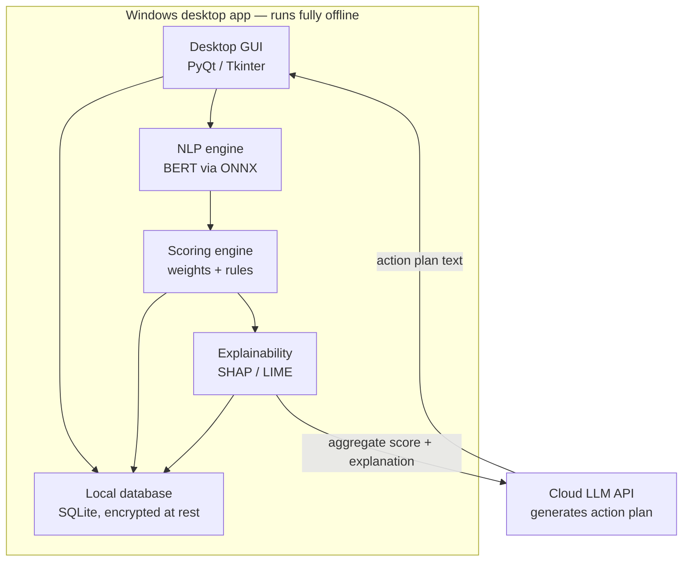
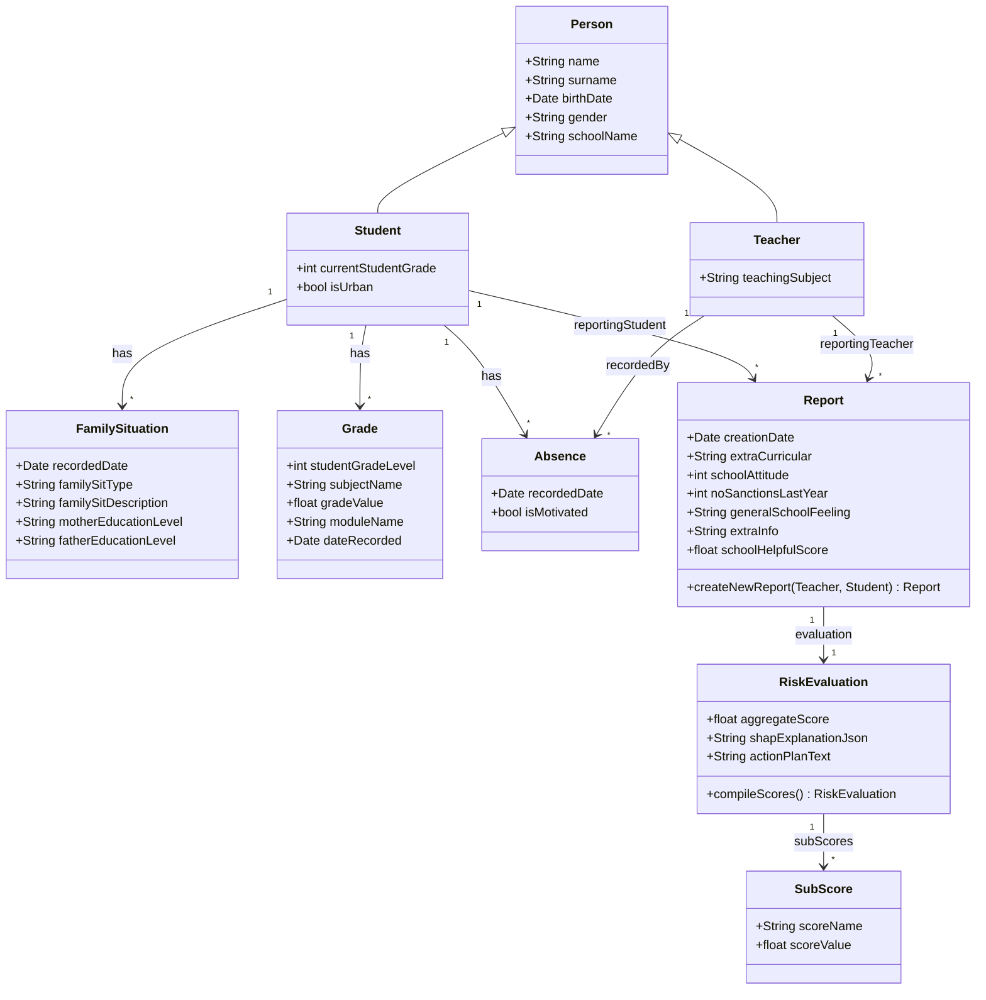
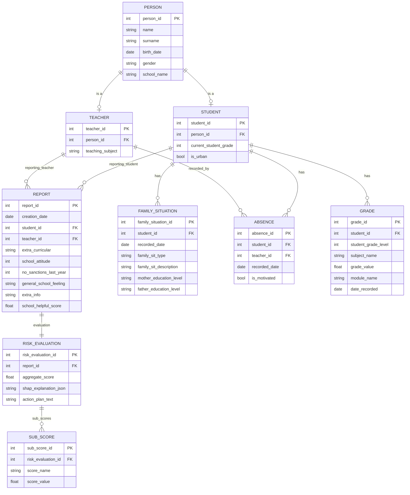

# Student Risk Assessment & Intervention Planner

A Windows desktop application that helps teachers identify students at risk of academic disengagement or dropout, and generates personalized, explainable intervention plans. The app is designed for non-technical users and runs almost entirely offline, with a single external call to an LLM API for generating human-readable action plans.

## Overview

Teachers enter short qualitative observations and structured data about a student (attendance, grades, family context, school attitude). The app combines this data through a local scoring pipeline — NLP sentiment/valence analysis, a weighted risk model, and explainability analysis — to produce:

- **An aggregate risk score** and a set of interpretable **sub-scores**
- **A transparent explanation** of which factors drove the score, and by how much
- **A suggested action plan**, written in plain language, proposing concrete steps to support the student

The goal is to give teachers something they can trust and act on — not a black-box number, but a score paired with a clear, evidence-based reason.

## Why this architecture

Because this app evaluates real students using sensitive personal and family data, the design keeps as much processing on-device as possible. The only data that ever leaves the machine is the already-computed score and its explanation — sent to an LLM API purely to turn that structured result into readable text. No raw student records, qualitative text, or personal identifiers need to cross the network.

## Architecture



### Components

| Component | Responsibility | Notes |
|---|---|---|
| **Desktop GUI** | Collects teacher input, displays scores and action plans | Only layer that interacts with the user directly |
| **NLP engine** | Extracts emotional valence and qualitative risk signals from free-text observations | BERT model exported to ONNX for smaller footprint and faster local inference |
| **Scoring engine** | Combines NLP output and structured factors into sub-scores and an aggregate score | Pure local logic; no external calls |
| **Explainability** | Attributes the score to individual factors using SHAP/LIME | Runs against the scoring engine's real inputs/outputs — not simulated by an LLM |
| **Local database** | Persists students, reports, grades, absences, family situations, and evaluations | SQLite, encrypted at rest |
| **Cloud LLM API** | Converts the numeric score + SHAP/LIME explanation into a written action plan | The only network-dependent step; app remains functional (minus this step) if offline |

## Data model

### Class diagram



### Entity-relationship diagram



### Design notes

- `Person` is a shared base for `Student` and `Teacher` to avoid duplicating name/birth date/gender fields.
- `FamilySituation`, `Absence`, and `Grade` all belong to `Student` directly (not `Report`), since they represent ongoing facts about the student rather than data generated by a single report.
- `FamilySituation` keeps a full history (one-to-many) rather than storing only the current state, so changes over time remain queryable.
- "Lowest grade subjects" and "previous module grade" are **not stored** — both are computed at evaluation time by querying `Grade`, avoiding data that can drift out of sync with the source of truth.
- `Absence` records both the student and the recording teacher, since a teacher — not the student — logs each absence.
- `RiskEvaluation` and `SubScore` are kept separate from `Report`: `Report` holds only the raw input collected from a teacher; `RiskEvaluation` holds the computed, explainable output.

## Explainability approach

The app avoids using an LLM to *simulate* the output of ML models — this was an early design mistake in the project (an LLM asked to "act like" SHAP produces plausible-looking but fabricated attribution numbers, which is not explainability). Instead:

1. The scoring engine runs a real model over the student's actual data.
2. SHAP and LIME are run against that real model to produce genuine feature attributions.
3. Only the resulting scores and attribution data are passed to the LLM, whose sole job is to phrase that already-validated information as a readable action plan — not to invent it.

### SHAP and LIME answer different questions

They are not redundant, and they are **not interchangeable**:

| | SHAP ([app/explainability.py](app/explainability.py)) | LIME ([app/lime_explainer.py](app/lime_explainer.py)) |
|---|---|---|
| Question | How is this probability *composed*? | What locally *distinguishes* this student? |
| Scope | Global feature importance + per-case decomposition | The individual student's risk profile |
| Output | Signed contribution per feature, in probability points | A short rule list (`Media modulului anterior <= 6.20`) |
| Additive? | **Yes** — `base_value + Σ shap ≈ P(dropout)` | **No** — local surrogate coefficients |
| Feeds | Domain sub-scores, the LLM payload, the global research figure | Report page 3, read directly by the teacher |

Because LIME's weights are not additive, they must never be substituted into the sub-scores or the LLM prompt — both depend on the additivity SHAP guarantees. A test pins this contract.

**Local fidelity is always reported.** A local surrogate can fit badly, so every LIME profile carries its R² over the perturbed neighbourhood plus the surrogate's own prediction next to the model's real probability. A weak fit is shown *labelled as weak* rather than silently trusted — on a representative high-risk case the surrogate reached R² = 0.41 ("moderată") and predicted 0.853 against the model's actual 0.948, which is exactly the kind of divergence a teacher should see before acting on the rule list.

## Privacy & data handling

- All student data is stored locally in a SQLite database (see the implementation-status note — encryption at rest is not yet implemented).
- Only the aggregate score, sub-scores, and SHAP explanation are sent to the external LLM API — no raw qualitative text or personally identifying information.

### Quasi-identifier reduction in the cloud payload

Direct identifiers were never sent. But age + sex + family situation + both parents' education, taken *together*, could re-identify a student in a small school even with no name attached — under GDPR that makes the payload personal data, not anonymous data. The cloud context therefore also reduces the quasi-identifiers ([app/llm_client.py](app/llm_client.py)):

| Field | Sent before | Sent now | Rationale |
|---|---|---|---|
| Exact age | `17 ani` | *dropped* | Nothing in the intervention table keys off it |
| Sex | `Feminin` | *dropped* | Not used by any intervention, not a top SHAP driver |
| Family situation | 4 categories | 3 buckets (`ambii părinți` / `un singur adult` / `tutore / altă situație`) | Preserves the distinction that changes the action — involving a guardian differs from involving both parents |
| Parents' education | 2 × 6 levels (36 combos) | one numeric index (`-0.30 … +0.50`) | Both already mapped to *identical* intervention text, so merging costs nothing actionable |
| Residential environment | `Rural` | *kept* | Only 2 values, and it drives a real intervention (transport / digital access for commuting students) |

The index reuses the model's own `_EDUCATION_RISK` coefficients, so the number the LLM sees is the same quantity that drove the prediction. **The local plan keeps full detail** — it never leaves the machine and is read by a teacher who already knows the student. `_questionnaire_context_lines` defaults to the de-identified form so a caller that forgets the flag gets the safe payload rather than a leak, and [tests/test_deidentification.py](tests/test_deidentification.py) pins the whole contract.
- API keys are stored via the OS credential manager, not in plaintext configuration files.
- Generated action plans are intended as decision support for a teacher to review, not as an automated decision.

## Tech stack

### Languages & runtime

| Language | Version | Where it is used |
|---|---|---|
| **Python** | 3.12 (developed and CI-built on 3.12.8) | The entire application: ML core, GUI, persistence, report generation |
| **SQL** (SQLite dialect) | SQLite 3 via the stdlib `sqlite3` module | Local schema and queries in [app/database.py](app/database.py) |
| **HTML/CSS** (Qt rich text) | Qt 6 subset | Report rendering and PDF export in [app/ui/report.py](app/ui/report.py) |
| **YAML** | — | CI build definition in [.github/workflows/build.yml](.github/workflows/build.yml) |

The build target is Windows (x64); the ML/DB core itself is platform-independent, but packaging and the credential vault are Windows-specific.

### Libraries

Declared constraints live in [requirements.txt](requirements.txt) (runtime) and [requirements-dev.txt](requirements-dev.txt) (tooling). The "Verified" column records the versions the current results were actually produced with.

#### Runtime

| Library | Constraint | Verified | Role |
|---|---|---|---|
| `numpy` | `>=1.26` | 2.4.6 | Numeric arrays; synthetic-data generation, metric arithmetic |
| `pandas` | `>=2.1` | 3.0.3 | Feature frames; fixed column order fed to the model |
| `scikit-learn` | `>=1.3` | 1.9.0 | Train/test split, stratified k-fold CV, all evaluation metrics, calibration |
| `xgboost` | `>=2.0` | 3.3.0 | The gradient-boosted tree classifier that produces P(dropout) |
| `imbalanced-learn` | `>=0.12` | 0.14.2 | `SMOTENC` oversampling + the `Pipeline` that keeps resampling inside each CV fold |
| `shap` | `>=0.44` | 0.52.0 | Global feature importance + the additive per-case decomposition feeding sub-scores and the LLM payload |
| `lime` | `>=0.2` | 0.2.0.1 | The individual student's local risk profile — a readable rule list on its own report page |
| `matplotlib` | `>=3.7` | 3.11.0 | The six evaluation figures written to `metrici_model/` |
| `openpyxl` | `>=3.1` | 3.1.5 | Batch import of Google-Forms questionnaire exports (`.xlsx`) |
| `PySide6` | `>=6.6,<6.9` | 6.8.3 | Qt 6 desktop GUI (LGPL), report rendering, PDF export |
| `anthropic` | `>=0.40` | 0.116.0 | Optional cloud provider for action-plan text (Claude) |
| `google-genai` | `>=1.0` | 2.10.0 | Optional cloud provider for action-plan text (Gemini) |
| `keyring` | `>=24` | 25.7.0 | Stores the API key in the Windows Credential Manager instead of plaintext |

Both LLM SDKs are imported **lazily**. With no key configured, or offline, the app falls back to a local template and stays fully functional.

#### Development & build

| Library | Constraint | Role |
|---|---|---|
| `pytest` | `>=8.0` | Test suite in [tests/](tests/) |
| `pyinstaller` | `>=6.6` | Packages the single-file Windows executable via [RiskSolvingApp.spec](RiskSolvingApp.spec) |

### Implementation status vs. the design above

Two items in the architecture diagram remain design intent rather than shipped code, and are documented honestly here:

- **NLP engine** — the design calls for BERT exported to ONNX. The proof-of-concept instead ships a transparent **lexicon-based Romanian valence analyzer** ([app/nlp_engine.py](app/nlp_engine.py)) with the same return contract, so a real ONNX model can replace `analyze()` without touching anything downstream. Note that `Stres_Emotional_NLP` is a *trained* model feature, so a real NLP swap shifts its distribution and requires retraining.
- **Local database** — SQLite is currently stored **unencrypted**; a production build would layer SQLCipher or OS-level encryption (see the note in [app/database.py](app/database.py)).

**Explainability is implemented in full**, with SHAP and LIME answering deliberately different questions — see below.

## Metrics

The app computes three distinct families of numbers. They answer different questions and should not be mixed.

### 1. Model evaluation metrics (how good is the classifier?)

Computed in `train_model()` in [app/scoring_engine.py](app/scoring_engine.py) and rendered as PNGs by [app/model_report.py](app/model_report.py).

**Protocol.** The dataset is split stratified with `test_size = 0.25` and `random_state = 42`. `SMOTE-NC` is fitted on the **training partition only**; every figure below is computed on the **un-resampled hold-out**, so it reflects the real class balance rather than the oversampled one. Let the confusion matrix be `[[TN, FP], [FN, TP]]` with the positive class = dropout risk, `p_i` the predicted probability and `y_i ∈ {0,1}` the true label over `n` test cases.

| Metric | Formula | Notes |
|---|---|---|
| Accuracy | `(TP + TN) / (TP + TN + FP + FN)` | Misleading alone under class imbalance |
| Balanced accuracy | `(sensitivity + specificity) / 2` | Imbalance-robust counterpart |
| Precision (dropout) | `TP / (TP + FP)` | Of those flagged, how many really were at risk |
| Recall / sensitivity | `TP / (TP + FN)` | Of those at risk, how many were caught — the metric that matters most here |
| Specificity | `TN / (TN + FP)` | Computed directly from the confusion matrix |
| F1 (dropout) | `2 · precision · recall / (precision + recall)` | Harmonic mean |
| G-mean | `√(sensitivity × specificity)` | Penalises trading one class off against the other |
| MCC | `(TP·TN − FP·FN) / √((TP+FP)(TP+FN)(TN+FP)(TN+FN))` | Correlation in `[−1, 1]`; robust to imbalance |
| ROC-AUC | Area under TPR-vs-FPR, swept over all thresholds | Threshold-independent ranking quality |
| PR-AUC | Average precision, `Σ (R_k − R_{k−1}) · P_k` | Preferred over ROC-AUC when positives are rare |
| Brier score | `(1/n) Σ (p_i − y_i)²` | **Calibration** error — lower is better; the only metric here scored downwards |

**Cross-validation.** Stratified 5-fold (`CV_FOLDS = 5`), with SMOTE-NC re-fitted *inside* each fold via an `imblearn.pipeline.Pipeline`, so no oversampled row ever leaks into a validation fold. Reported as mean ± SD across folds for accuracy, ROC-AUC, PR-AUC and F1. The SD is NumPy's population standard deviation (`ddof = 0`).

**Figures.** `python train.py --metrics-dir <DIR>` writes six PNGs into `<DIR>/metrici_model/`: confusion matrix, ROC curve, precision–recall curve, calibration (reliability) diagram, global SHAP summary, and a summary table of every scalar above. Each figure is best-effort — one failing plot is skipped rather than aborting the run.

### 2. Per-student scoring metrics (what does one student's report say?)

| Metric | How it is computed |
|---|---|
| **P(dropout)** | `XGBClassifier.predict_proba(X)[0, 1]` on the encoded feature row |
| **Aggregate score** | `round(P × 100, 1)` — the 0–100 headline number |
| **Risk tier** | Probability bands: *Moderat* ≥ 0.00, *Mediu* ≥ 0.20, *Ridicat* ≥ 0.42, *Critic* ≥ 0.65. A *Ridicat* case is **escalated to Critic** when ≥ 3 severe factors compound (extreme absences, average below 5, engagement ≤ 2/10, active sanctions, or crisis-level emotional stress) |
| **SHAP attributions** | Permutation explainer over `predict_proba` in **probability space**, against a 200-row background sample. Additive by construction: `base_value + Σ shap_values ≈ P(dropout)`, so "+18 points" is a true decomposition of the model's real output |
| **Sub-scores** | Each feature maps to a domain (frequency, academic performance, family context, …); a domain's sub-score is its share of total attribution magnitude: `Σ\|shap\| within domain / Σ\|shap\| overall × 100`. Sums to ~100 |
| **LIME local profile** | Local surrogate over 5000 proximity-weighted perturbations of the student's row, fitted with a sparse linear model; reports up to 8 rules. Seeded (`RANDOM_SEED`) for reproducibility. Marginal cost ≈ 22 ms/student |
| **LIME fidelity (R²)** | The surrogate's coefficient of determination over that perturbed neighbourhood, banded for display: ≥ 0.70 *bună*, ≥ 0.40 *moderată*, else *slabă*. Shown alongside `local_gap = \|local_prediction − model_probability\|` so surrogate divergence is visible |
| **Studentship score** | Composite in `[0, 10]`: `+0–2` each for extracurricular participation, attitude, how they feel at school, perceived support, and absence of sanctions; then penalties `−min(2, unexcused/12) − min(1, excused/20) − min(2, grades_below_5/3)` |
| **Emotional stress (NLP)** | Weighted lexicon hits with a 3-token negation window, squashed into `[0, 2]` by `2 · (1 − 1/(1 + raw))`. Valence = `(pos − neg) / (pos + neg)` in `[−1, 1]` |

### 3. LLM performance metrics (what does the cloud step cost?)

Tracked per call in [app/metrics.py](app/metrics.py), viewable under the **Performanță** menu and exportable as CSV (one row per generated report) for statistical analysis.

**No personal data is recorded here.** The run `label` reaches both `metrics_runs.jsonl` and the exported CSV, which is meant to be shared as research data, so single runs are labelled by risk band (`metrics.single_run_label`) rather than by student name. A regression test guards this.

| Metric | How it is computed |
|---|---|
| Latency | Wall-clock seconds around the provider call |
| Input / output / thinking tokens | As reported by the provider's usage payload |
| Billed output tokens | `output_tokens + thinking_tokens` — reasoning tokens bill at the output rate on both providers |
| **Cost (USD)** | `input/1e6 × input_rate + billed_output/1e6 × output_rate`, from the dated price table `MODEL_PRICING` (snapshot `PRICING_AS_OF`). Returns `None` — displayed `—` — when the model's price is unknown, so cost is never silently guessed |
| Aggregates | Total / mean / min / max / SD of latency; SD is the **sample** standard deviation (`statistics.stdev`, `ddof = 1`) |
| Cost per report vs. per cloud call | `cost_per_report` averages over *all* reports (local fallbacks cost $0 and pull the mean down); `cost_per_cloud_call` isolates the genuinely billed calls — that is the figure to quote per API call |

Local and fallback generations make no billable request and are recorded with cost `0.0`, distinguished by their `source` field (`cloud` / `local` / `local-fallback`).

### Reproducing the numbers

```bash
python train.py                          # train + print the full metric suite
python train.py --metrics-dir .          # also write the six figures to ./metrici_model/
python train.py --plot shap_summary.png  # just the global SHAP figure
```

Training is deterministic given `--samples` (default 2800) and `--seed` (default 42), and `holdout_predictions()` regenerates the exact same split, so the figures always match the reported scalars.
