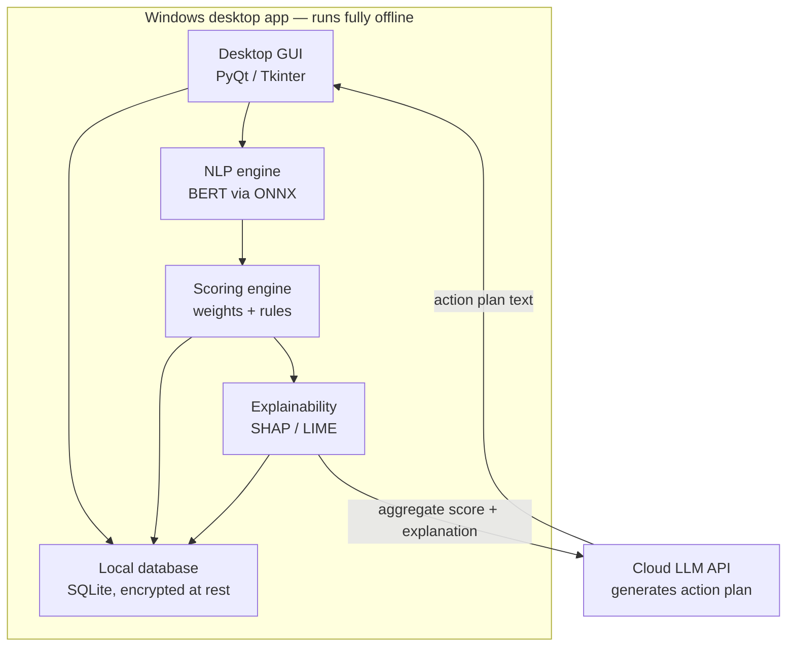
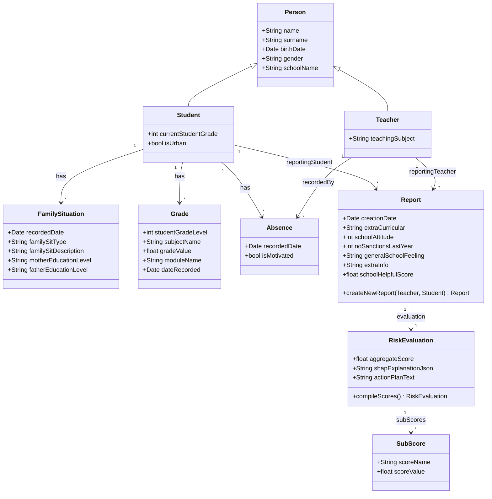
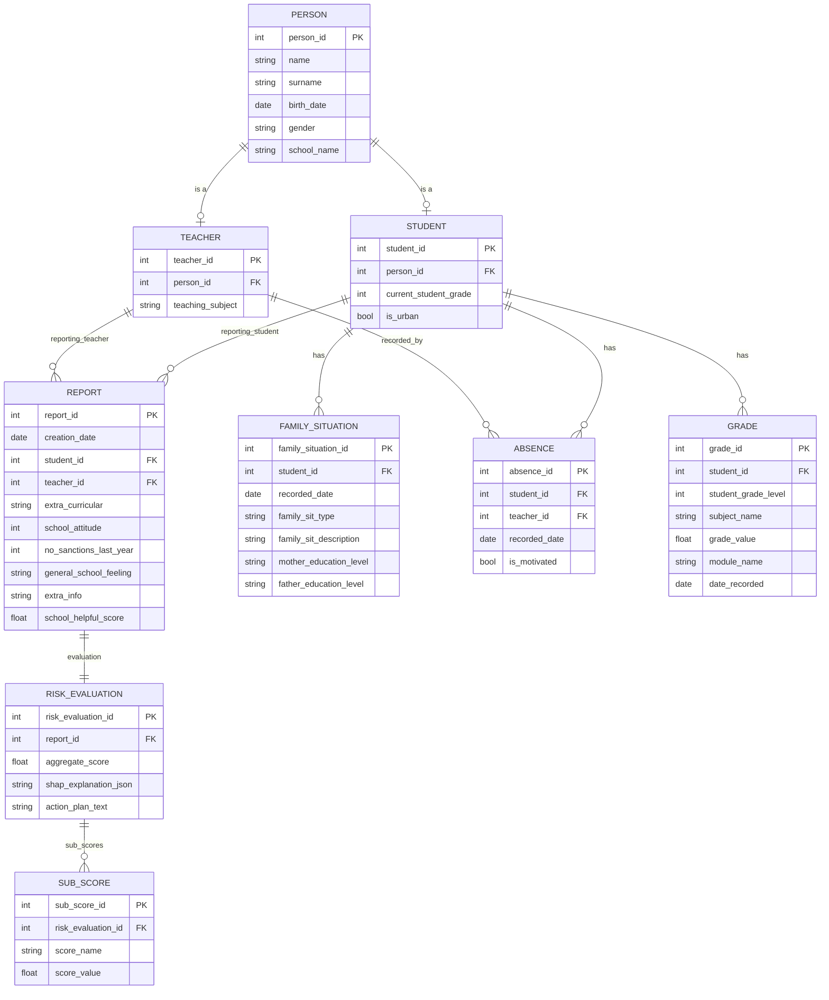

# Student Risk Assessment & Intervention Planner

A Windows desktop application that helps teachers identify students at risk of academic disengagement or dropout, and generates personalized, explainable intervention plans. The app is designed for non-technical users and runs almost entirely offline, with a single external call to an LLM API for generating human-readable action plans.

## Overview

Teachers enter short qualitative observations and structured data about a student (attendance, grades, family context, school attitude). The app combines this data through a local scoring pipeline — NLP sentiment/valence analysis, a weighted risk model, and explainability analysis — to produce:

- **An aggregate risk score** and a set of interpretable **sub-scores**
- **A transparent explanation** of which factors drove the score, and by how much
- **A suggested action plan**, written in plain language, proposing concrete steps to support the student

The goal is to give teachers something they can trust and act on — not a black-box number, but a score paired with a clear, evidence-based reason.

## Why this architecture

Because this app evaluates real students using sensitive personal and family data, the design keeps as much processing on-device as possible. The only data that ever leaves the machine is the already-computed score and its explanation — sent to an LLM API purely to turn that structured result into readable text. No raw student records, qualitative text, or personal identifiers need to cross the network.

## Architecture

### Components

| Component | Responsibility | Notes |
|---|---|---|
| **Desktop GUI** | Collects teacher input, displays scores and action plans | Only layer that interacts with the user directly |
| **NLP engine** | Extracts emotional valence and qualitative risk signals from free-text observations | BERT model exported to ONNX for smaller footprint and faster local inference |
| **Scoring engine** | Combines NLP output and structured factors into sub-scores and an aggregate score | Pure local logic; no external calls |
| **Explainability** | Attributes the score to individual factors using SHAP/LIME | Runs against the scoring engine's real inputs/outputs — not simulated by an LLM |
| **Local database** | Persists students, reports, grades, absences, family situations, and evaluations | SQLite, encrypted at rest |
| **Cloud LLM API** | Converts the numeric score + SHAP/LIME explanation into a written action plan | The only network-dependent step; app remains functional (minus this step) if offline |

## Data model

### Class diagram

### Entity-relationship diagram

### Design notes

- `Person` is a shared base for `Student` and `Teacher` to avoid duplicating name/birth date/gender fields.
- `FamilySituation`, `Absence`, and `Grade` all belong to `Student` directly (not `Report`), since they represent ongoing facts about the student rather than data generated by a single report.
- `FamilySituation` keeps a full history (one-to-many) rather than storing only the current state, so changes over time remain queryable.
- "Lowest grade subjects" and "previous module grade" are **not stored** — both are computed at evaluation time by querying `Grade`, avoiding data that can drift out of sync with the source of truth.
- `Absence` records both the student and the recording teacher, since a teacher — not the student — logs each absence.
- `RiskEvaluation` and `SubScore` are kept separate from `Report`: `Report` holds only the raw input collected from a teacher; `RiskEvaluation` holds the computed, explainable output.

## Explainability approach

The app avoids using an LLM to *simulate* the output of ML models — this was an early design mistake in the project (an LLM asked to "act like" SHAP produces plausible-looking but fabricated attribution numbers, which is not explainability). Instead:

1. The scoring engine runs a real model over the student's actual data.
2. SHAP or LIME is run against that real model to produce genuine feature attributions.
3. Only the resulting scores and attribution data are passed to the LLM, whose sole job is to phrase that already-validated information as a readable action plan — not to invent it.

## Privacy & data handling

- All student data is stored locally in an encrypted SQLite database.
- Only the aggregate score, sub-scores, and SHAP/LIME explanation are sent to the external LLM API — no raw qualitative text or personally identifying information.
- API keys are stored via the OS credential manager, not in plaintext configuration files.
- Generated action plans are intended as decision support for a teacher to review, not as an automated decision.

## Tech stack

- **GUI:** PyQt / PySide
- **NLP:** BERT (exported to ONNX, run via ONNX Runtime)
- **Explainability:** SHAP, LIME
- **Local storage:** SQLite (encrypted at rest)
- **Packaging:** PyInstaller (or Nuitka)
- **External dependency:** LLM API (e.g., Gemini or equivalent) for action plan generation
